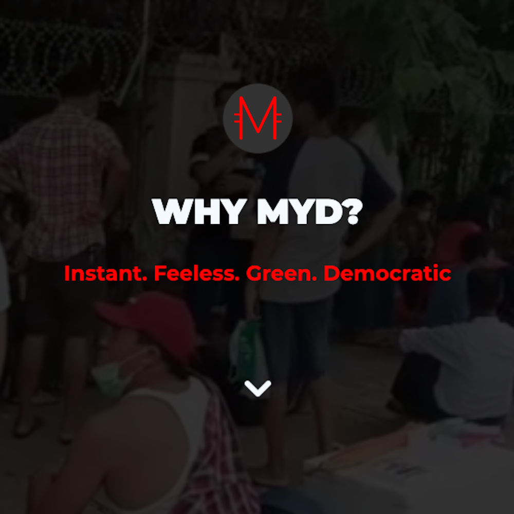

# www.myd.money



## Introduction

[www.myd.money](www.myd.money) is a website with the purpose of giving a simple and quick introduction and overview of the [MYD](www.myd.money) cryptocurrency. Send it to your friends and people you would like to introduce to MYD.

## Translations

Right now, the page is available in English and Myanmar. To add a language, copy the [english template](languages/en.json), replace the text with the translation and rename the file to "iso-code".json (e.g. de.json for german).

## Contribute

If you would like to help translate this page into more languages or contribute in any other way, please open a pull request.

## Contributors

[The Myanmar Dollar Project](https://github.com/TheMyanmarDollar) - Forking and Myanmar Translations

## Development Setup

Running the MYD Website as a Developer:

### MongoDB

Set up mongodb atlas cluster, free account tier in the cloud

### Node

Install node (on Ubuntu) curl -sL https://deb.nodesource.com/setup_12.x | sudo -E bash - apt install nodejs

### Git

Fork the repo https://github.com/TheMyanmarDollar/whymyd and clone your forked repo

```code
$ git clone https://github.com/{yourname}/whymyd
$ cd whymyd
$ npm install
$ npm install dotenv --save
```

Create .env file like this with mongo creds you made earlier:

```code
$ nano .env
```

```info
MONGODB_USER=myduser
MONGODB_PW=strongpassword
MONGODB_URL=myurl.mongodb.net
MONGODB_DB=myddb PORT=5000
```

### Run

```
$ npm start
```

## Notes

### Notes on **css**

Edit css using .scss files under **/scss** folder

## Finally

Visit in the browser: http://127.0.0.1:5000/ or http://localhost:5000
